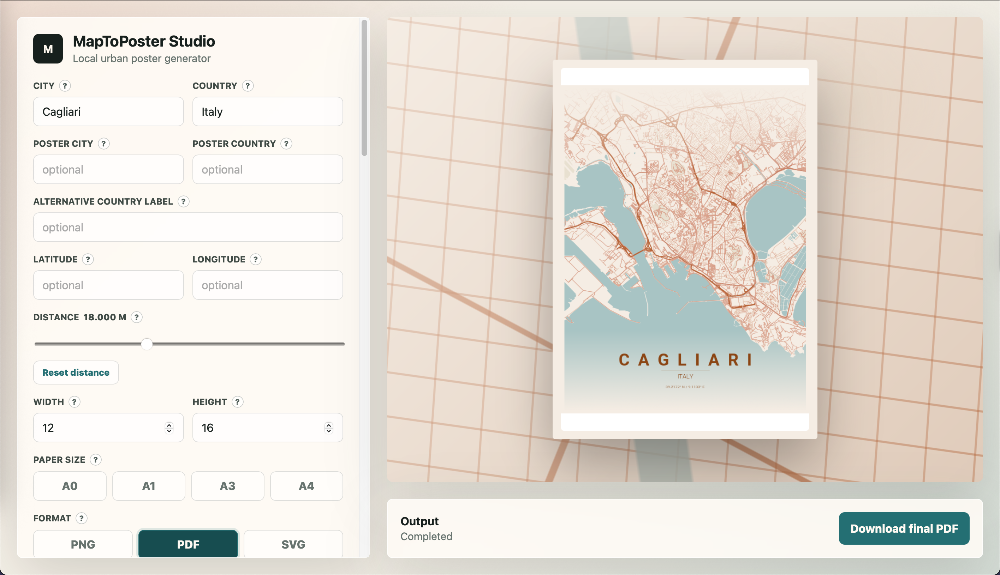

<p>
  
</p>

# MapToPoster Webapp, a local graphical interface based on [originalankur/maptoposter](https://github.com/originalankur/maptoposter)

**Open the app locally:** run `./start.sh`, then open
[`http://127.0.0.1:8080`](http://127.0.0.1:8080).

This repository adds a local webapp to the MapToPoster cartographic poster
generator. The goal is to make the original project easier to use: choose a
city, change the theme, preview the actual output, and download the final poster
as PDF, PNG, or SVG without remembering command-line arguments.

The generation logic is still centered on the original
[`originalankur/maptoposter`](https://github.com/originalankur/maptoposter)
work; this version adds a UI, local caches, print presets, a homepage with
examples, and management tools.

## Studio Preview

The studio is the main generation interface: choose a city, adjust the output,
select a theme, and download the final poster.

<p>
  
</p>

## Poster Examples

<p>
  
  
  
  
</p>

More homepage examples:

| City | Theme | Preview |
|------|-------|---------|
| San Francisco | Sunset |  |
| Venice | Blueprint |  |
| Mumbai | Contrast Zones |  |
| Seattle | Emerald |  |

## Main Features

- Homepage with example posters loaded from `posters/`.
- Informational `What is MapToPoster` page, linked from the homepage.
- Local web studio for generating posters.
- Automatic preview when you change city, theme, distance, paper size, output format, or font.
- Selectable themes with mini previews.
- Download as `PDF`, `PNG`, or `SVG`.
- Generate every theme into one ZIP archive.
- Progress output for multi-theme generation, including how many images are left.
- Paper presets for `A0`, `A1`, `A3`, and `A4`.
- Quick distance reset to `18,000 m`.
- Clear message when a city cannot be found.
- Local cache for capitals, large cities, map data, and previews.
- Optional startup cleanup for cache and unnecessary generated posters.

## Quick Start

The recommended way to start the app is:

```bash
./start.sh
```

The script asks:

```text
Clean cache and unnecessary posters? [y/N]:
IP/host [127.0.0.1]:
Port [8080]:
```

Press Enter to use the defaults:

```text
http://127.0.0.1:8080
```

Cleanup is optional. If you answer `y`, runtime caches are removed and generated
files in `posters/` that are not needed by the homepage are deleted. The posters
to keep are tracked in:

```text
data/homepage_posters.json
```

## Manual Installation

With `uv`:

```bash
uv sync --locked
uv run webapp/app.py
```

With `venv` and `pip`:

```bash
python3 -m venv .venv
.venv/bin/python -m pip install --upgrade pip
.venv/bin/python -m pip install -r requirements.txt
.venv/bin/python webapp/app.py
```

You can also specify host and port:

```bash
.venv/bin/python webapp/app.py 127.0.0.1 8080
```

For compatibility, you can pass only the port:

```bash
.venv/bin/python webapp/app.py 8765
```

## Web Pages

| Path | Description |
|------|-------------|
| `/` | Homepage with a gallery of generated posters |
| `/about.html` | Informational page about the project and the original work |
| `/about` | Alias for the informational page |
| `/studio` | Main poster generation interface |

## Using the Webapp

1. Open `http://127.0.0.1:8080`.
2. From the homepage, browse examples or open the studio.
3. In the studio, choose city, country, theme, format, and dimensions.
4. The preview regenerates automatically after changes.
5. When the preview is ready, use the final download button.
6. If `Tutti i temi` is enabled, the app generates a ZIP containing every theme.

The recommended format for printing is `PDF`.

## Presets and Output Formats

The webapp includes vertical paper presets:

| Preset | Size in inches |
|--------|----------------|
| A0 | `33.1 x 46.8` |
| A1 | `23.4 x 33.1` |
| A3 | `11.7 x 16.5` |
| A4 | `8.3 x 11.7` |

Download formats:

| Format | Recommended Use |
|--------|-----------------|
| PDF | Printing and best quality |
| PNG | Raster image ready to share |
| SVG | Editable vector output |

## Cache and Performance

The project uses several cache layers:

| Path | Content |
|------|---------|
| `data/capitals.json` | Local archive of world capitals |
| `data/top_cities.json` | Up to 10 large cities per country |
| `cache/` | Coordinates and OpenStreetMap/OSMnx data |
| `webapp/.cache/previews/` | Lightweight PNG previews for the webapp |
| `fonts/cache/` | Fonts downloaded from Google Fonts |

The first generation for a large city can take time, especially if OSM data is
not cached yet. Later generations reuse local data whenever possible.

## Cleaning Cache and Posters

Cleanup can be launched from `start.sh`, or manually:

```bash
.venv/bin/python tools/cleanup_runtime.py
```

The command:

- removes `webapp/.cache`;
- keeps files listed in `data/homepage_posters.json`;
- removes other generated files from `posters/`.

Use it when you want to lighten the workspace without losing the homepage
gallery.

## Updating Local Archives

### Capitals

```bash
.venv/bin/python tools/build_capitals_archive.py
```

### Large Cities

```bash
.venv/bin/python tools/build_top_cities_archive.py
```

### Warm the Map Data Cache

To prefetch OSM data for a country:

```bash
.venv/bin/python tools/warm_map_cache.py --country USA --limit 10
```

This reduces waiting time later for cities that have already been warmed.

## Command-Line Usage

The webapp is the easiest path, but you can still use the CLI generator:

```bash
.venv/bin/python create_map_poster.py --city "Paris" --country "France"
```

Example with theme, format, and dimensions:

```bash
.venv/bin/python create_map_poster.py \
  --city "New York" \
  --country "USA" \
  --theme blueprint \
  --distance 18000 \
  --width 8.3 \
  --height 11.7 \
  --format pdf
```

Generate every theme:

```bash
.venv/bin/python create_map_poster.py \
  --city "Rome" \
  --country "Italy" \
  --all-themes \
  --format png
```

List available themes:

```bash
.venv/bin/python create_map_poster.py --list-themes
```

## Main CLI Options

| Option | Alias | Description |
|--------|-------|-------------|
| `--city` | `-c` | City name |
| `--country` | `-C` | Country name |
| `--latitude` | `-lat` | Manual latitude |
| `--longitude` | `-long` | Manual longitude |
| `--country-label` | | Alternate country text on the poster |
| `--display-city` | `-dc` | City name displayed on the poster |
| `--display-country` | `-dC` | Country name displayed on the poster |
| `--font-family` | | Google Fonts family |
| `--theme` | `-t` | Graphic theme |
| `--all-themes` | | Generate every theme |
| `--distance` | `-d` | Map radius in meters |
| `--width` | `-W` | Width in inches |
| `--height` | `-H` | Height in inches |
| `--format` | `-f` | `png`, `svg`, or `pdf` |
| `--list-themes` | | Show available themes |

## Multilingual Support

You can use display names that differ from the names used to locate the city:

```bash
.venv/bin/python create_map_poster.py \
  --city "Tokyo" \
  --country "Japan" \
  --display-city "東京" \
  --display-country "日本" \
  --font-family "Noto Sans JP"
```

Another example:

```bash
.venv/bin/python create_map_poster.py \
  --city "Dubai" \
  --country "UAE" \
  --display-city "دبي" \
  --display-country "الإمارات" \
  --font-family "Cairo"
```

## Project Structure

```text
.
├── create_map_poster.py          # Main generator
├── webapp/
│   ├── app.py                    # Local HTTP server
│   └── static/                   # Webapp HTML, CSS, and JS
├── tools/
│   ├── build_capitals_archive.py
│   ├── build_top_cities_archive.py
│   ├── cleanup_runtime.py
│   └── warm_map_cache.py
├── data/
│   ├── capitals.json
│   ├── top_cities.json
│   └── homepage_posters.json
├── themes/                       # JSON graphic themes
├── posters/                      # Generated posters and homepage posters
├── cache/                        # OSM/geocoding cache
├── fonts/                        # Local fonts/cache
└── start.sh                      # Guided webapp startup
```

## Notes

- The `OpenStreetMap contributors` label is not drawn on the final poster.
- If a city cannot be found, enter latitude and longitude manually.
- If port `8080` is busy, choose another port when `start.sh` asks.
- To expose the server on your local network, use a host such as `0.0.0.0`.

## Credits

This work is a graphical interface and local tooling layer built on top of
[`originalankur/maptoposter`](https://github.com/originalankur/maptoposter).
Geographic data comes from OpenStreetMap through the libraries used by the
generator.

This webapp and the surrounding local tooling were developed with Codex.
